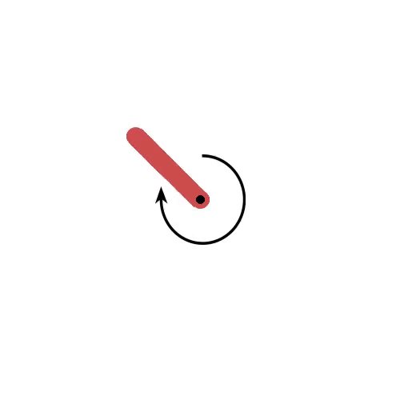
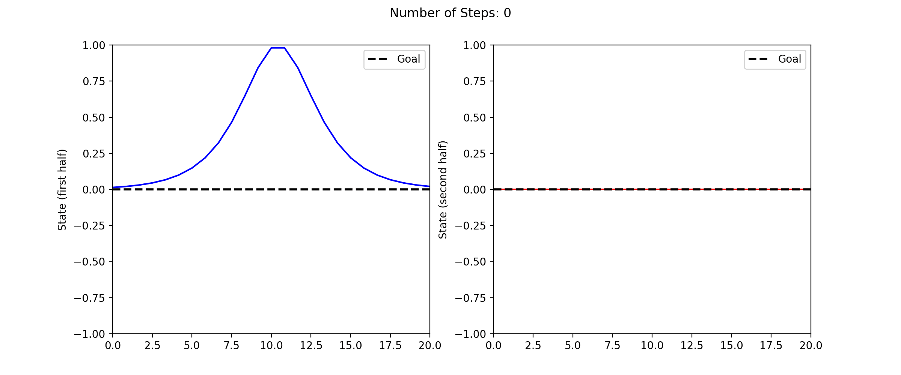

Embedded Control on Equivariant Manifold Flows
===

This is the implementation of the paper [Embedded Control on Equivariant Manifold Flows](https://arxiv.org/abs/2312.01544).

An efficient way to control systems with unknown nonlinear dynamics is to find an appropriate embedding or representation for linear approximation, which facilitates system identification and control synthesis. Nevertheless, there has been a lack of embedding methods that can guarantee (i) embedding the system comprehensively and symmetrically, including the equivariant vector fields of dynamics, and (ii) preserving the consistency of control effect between the original space and latent space. To address these challenges, we propose Koopman Embedded Equivariant Control (KEEC), which utilizes the Koopman and Lie theory. KEEC learns embedded equivariant flows and vector fields in a latent manifold and preserves the effectiveness of the control policy in the latent manifold by preserving Riemannian metric. Due to the comprehensive embedding, KEEC enables the optimal policy to be analytically extracted from the latent invariant value function based on Hamiltonian-Jacobi theory, improving computational efficiency by avoiding extensive numerical optimization such as quadratic programming commonly used in model predictive control (MPC). In experiments conducted on environments including the Gym/image Pendulum, Lorenz-63 and the wave equation, our algorithm achieves higher rewards, shorter trajectory and greater robustness than the previous embedding control method and other competitive baselines from MPC, online and offline reinforcement learning.
## Control Demos
### Pendulum 

### Lorenz-63

### Wave equation
#### controlled wave equation

#### uncontrolled wave equation


## Install & Dependence
First, clone the repository:
```
git clone https://github.com/yyimingucl/Koopman-Embed-Equivariant-Control.git
```
Then install the dependencies as listed in ```environment.yml``` and activate the environment: 
```
conda env create -f environment.yml
conda activate koopman_policy
```
## Use
- for train
  ```
  python training_scripts/task_name/main.py
  ```
- for test
  ```
  python training_scripts/task_name/evaluate.py
  ```
The settings can be changed in the ```training_scripts/task_name/config.yaml```. We provide an example notebook with trained model in ```wave_example.ipynb```.
## Pretrained model
| Model | Task |
| ---     | ---   |
| trained_weights | wave |


## Directory Hierarchy
```
|—— convex_solver.py
|—— dataset.py
|—— environment.yml
|—— figures
|—— model.py
|—— requirements.txt
|—— roll_out.py
|—— train.py
|—— trained_weights
|—— training_scripts
|    |—— pendulum-gym
|        |—— config.yaml
|        |—— evaluate.py
|        |—— main.py
|    |—— wave
|        |—— config.yaml
|        |—— evaluate.py
|        |—— main.py
|—— utils.py
|—— wave_example.ipynb
|—— wrappers.py
```
